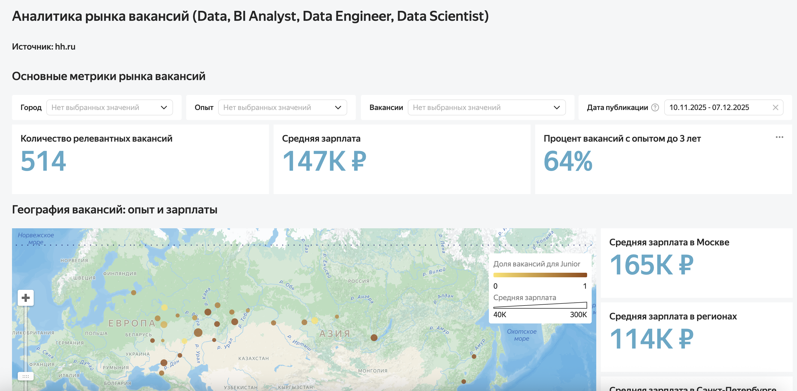

# Учебные дашборды

### Анализ рынка вакансий Data (hh.ru, последний месяц)

**Цель:** Исследовать рынок вакансий в сфере Data (Data Analyst, BI Analyst, Data Engineer, Data Scientist), выявить ключевые метрики, динамику публикаций, распределение по городам, уровню опыта и навыкам.  

**Инструменты:** Парсер данных с API hh.ru, Yandex DataLens, интерактивные фильтры по городу, роли, опыту и периоду, визуализация KPI, графиков и карт.  

**Результат:** Создан интерактивный дашборд с возможностью:
- Быстро оценивать количество вакансий, среднюю зарплату и долю junior/без опыта;  
- Видеть распределение вакансий по городам и регионам на карте;  
- Отслеживать динамику публикаций по неделям;  
- Сравнивать зарплаты по опыту и группам вакансий;  
- Анализировать ТОП-10 востребованных Hard/Soft навыков;  
- Фильтровать и изучать детальные данные по вакансиям.  

[Посмотреть дашборд онлайн](https://datalens.yandex/fz171acpm51c0)

### Отчет по планируемой и фактической выручке (Яндекс Практикум: курс DataLens)

**Цель:** Показать план и факт продаж по менеджерам и категориям, выявить товары с наибольшей выручкой. 

**Инструменты:** Yandex DataLens, фильтры, вычисляемые поля, сегментация данных.  

**Результат:** Создан интерактивный дашборд с фильтрами по менеджерам и дате заказа. Можно быстро сопоставить план и факт по выручке, визуализировать рост и спад продаж по категориям во времени.  

[Посмотреть дашборд онлайн](https://datalens.yandex/yglr158vstv2j)
